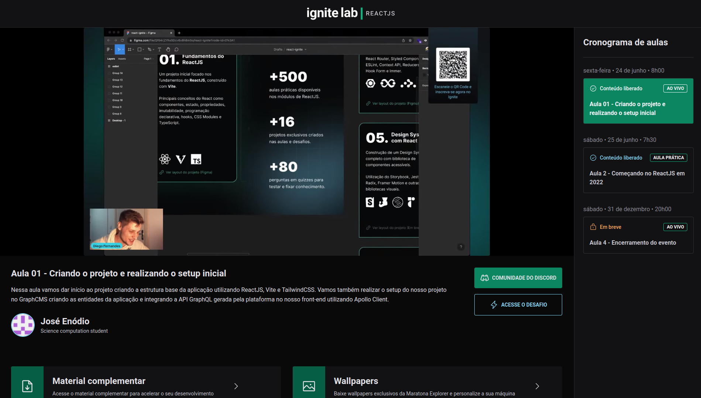

<p align="center">
  <a href="#-tecnologias">Tecnologias</a>&nbsp;&nbsp;&nbsp;|&nbsp;&nbsp;&nbsp;
  <a href="#-projeto">Projeto</a>&nbsp;&nbsp;&nbsp;|&nbsp;&nbsp;&nbsp;
</p>

<br>

<p align="center">
   
</p>

## 🚀 Tecnologias

Esse projeto foi desenvolvido com as seguintes tecnologias:

- [React](https://reactjs.org/)
- [Tailwind Css](https://tailwindcss.com/)
- [GraphQl](https://graphql.org/)
- [GraphCms](https://graphcms.com/)


## 🖥 Projeto

Essa é uma plataforma para transmissão de eventos ao vivo ou em aulas gravadas.<br>
Você pode acessar o projeto nesse link: https://ignite-lab-react-event-pearl.vercel.app/

## 💻 Baixar e iniciar projeto

Primeiro clone o repositório usando:

```
git clone https://github.com/JoseEnod/ignite-lab-react-event.git
```

Use um desses comandos para baixar as dependências do projeto:

```
yarn
```
ou
```
npm install
```

depois use esse comando para iniciar o servidor: 

```
yarn vite
```
ou
```
npm vite
```

e abra uma nova guia no seu navegador na url: http://localhost:3000/